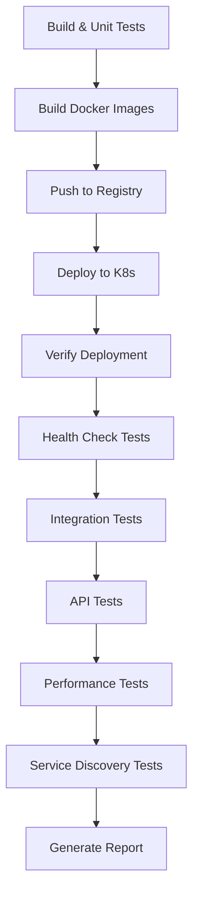

# 🧪 Estrategia de Pruebas en Kubernetes (Stage Environment)

## 📋 Resumen

Este documento describe la estrategia de pruebas implementada en el pipeline CI/CD para validar los microservicios desplegados en Kubernetes (stage environment).

---

## 🎯 Objetivos de las Pruebas

1. **Verificar** que los servicios se despliegan correctamente
2. **Validar** que los endpoints están funcionando
3. **Confirmar** la integración entre microservicios
4. **Asegurar** el rendimiento básico
5. **Generar** reportes de pruebas

---

## 📊 Stages del Pipeline

### 1. **Checkout** 🔄
- Clona el repositorio
- Obtiene el código fuente

### 2. **Build All Services** 🔨
- Compila todos los microservicios con Maven
- Genera los archivos JAR
- Puede saltar tests unitarios si se configura

### 3. **Unit Tests** 🧪
- Ejecuta pruebas unitarias de cada microservicio
- Genera reportes JUnit
- Se ejecuta antes del despliegue

### 4. **Build Docker Images** 🐳
- Construye imágenes Docker para cada servicio
- Etiqueta con número de build y 'latest'
- Usa multi-stage builds

### 5. **Push Docker Images** 📤
- Sube imágenes a Docker Registry
- Solo en rama 'main'
- Requiere credenciales configuradas

### 6. **Deploy to Kubernetes** ☸️
- Despliega infraestructura (Zipkin, Eureka, Config, Gateway)
- Despliega microservicios
- Actualiza imágenes con nuevo tag

### 7. **Verify Deployment** ✅
- Verifica que los deployments se completaron
- Espera a que los pods estén ready
- Muestra estado de pods y servicios

---

## 🧪 Pruebas en Stage Environment (Kubernetes)

### 8. **Health Check Tests** 🏥

**Objetivo**: Verificar que todos los servicios están saludables

**Qué se prueba**:
- ✅ Pods están corriendo
- ✅ Endpoint `/actuator/health` responde
- ✅ Estado de salud es UP

**Cómo funciona**:
```bash
# Obtiene el pod del servicio
POD_NAME=$(kubectl get pods -l app=user-service -o jsonpath='{.items[0].metadata.name}')

# Ejecuta curl dentro del pod
kubectl exec $POD_NAME -- curl http://localhost:8700/user-service/actuator/health
```

**Resultado esperado**:
```json
{
  "status": "UP"
}
```

---

### 9. **Integration Tests** 🔗

**Objetivo**: Verificar la integración entre microservicios y servicios de infraestructura

**Qué se prueba**:
- ✅ Servicios registrados en Eureka (Service Discovery)
- ✅ Trazas enviadas a Zipkin (Distributed Tracing)
- ✅ Conectividad entre servicios

**Pruebas específicas**:

#### a) Registro en Eureka
```bash
# Verifica que el servicio está registrado
kubectl exec $EUREKA_POD -- curl http://localhost:8761/eureka/apps | grep user-service
```

#### b) Trazas en Zipkin
```bash
# Verifica que hay trazas del servicio
kubectl exec $ZIPKIN_POD -- curl http://localhost:9411/api/v2/services | grep user-service
```

**Resultado esperado**:
- Todos los servicios aparecen en Eureka
- Zipkin tiene trazas de los servicios

---

### 10. **API Tests** 🌐

**Objetivo**: Probar los endpoints a través del API Gateway

**Qué se prueba**:
- ✅ API Gateway enruta correctamente
- ✅ Endpoints de actuator funcionan
- ✅ Comunicación end-to-end

**Cómo funciona**:
```bash
# Ejecuta request a través del API Gateway
kubectl exec $API_GATEWAY_POD -- curl http://localhost:8080/user-service/actuator/health
```

**Ventajas**:
- Prueba el flujo completo: Gateway → Service Discovery → Microservicio
- Valida el routing del Gateway
- Simula requests de clientes reales

---

### 11. **Performance Tests** ⚡

**Objetivo**: Verificar el rendimiento básico de los servicios

**Qué se prueba**:
- ✅ Tiempo de respuesta
- ✅ Capacidad de manejar múltiples requests
- ✅ Estabilidad bajo carga ligera

**Cómo funciona**:
```bash
# Ejecuta 10 requests y mide el tiempo
for i in {1..10}; do
    kubectl exec $POD_NAME -- curl -w "\nTiempo: %{time_total}s\n" \
        http://localhost:8700/user-service/actuator/health
done
```

**Métricas**:
- Tiempo promedio de respuesta
- Requests exitosos vs fallidos

---

### 12. **Service Discovery Tests** 🔍

**Objetivo**: Validar que el Service Discovery (Eureka) funciona correctamente

**Qué se prueba**:
- ✅ Eureka está UP
- ✅ Todos los servicios están registrados
- ✅ Información de instancias es correcta

**Comandos**:
```bash
# Ver servicios registrados
kubectl exec $EUREKA_POD -- curl http://localhost:8761/eureka/apps

# Ver estado de Eureka
kubectl exec $EUREKA_POD -- curl http://localhost:8761/actuator/health
```

---

### 13. **Generate Test Report** 📊

**Objetivo**: Generar un reporte completo de las pruebas

**Qué incluye**:
- ✅ Información del build
- ✅ Estado de todos los pods
- ✅ Estado de todos los servicios
- ✅ Estado de los deployments
- ✅ Eventos recientes del cluster

**Formato del reporte**:
```
=== REPORTE DE PRUEBAS EN KUBERNETES ===
Namespace: ecommerce-dev
Build: 42
Fecha: 2025-10-22 15:30:00

=== PODS DESPLEGADOS ===
NAME                              READY   STATUS    RESTARTS   AGE
user-service-7d8f9c5b6d-abc12     1/1     Running   0          5m
product-service-5c7d8e9f0a-def34  1/1     Running   0          5m
...

=== SERVICIOS ===
NAME               TYPE        CLUSTER-IP      EXTERNAL-IP   PORT(S)
user-service       ClusterIP   10.96.1.100     <none>        8700/TCP
...

=== DEPLOYMENTS ===
NAME              READY   UP-TO-DATE   AVAILABLE   AGE
user-service      2/2     2            2           5m
...

=== EVENTOS RECIENTES ===
...
```

**Archivo generado**: `test-report.txt` (archivado en Jenkins)

---

## 🔄 Flujo Completo de Pruebas



---

## 📈 Métricas de Éxito

### ✅ Criterios de Aceptación

| Prueba | Criterio de Éxito |
|--------|-------------------|
| **Health Checks** | Todos los servicios responden con status UP |
| **Integration** | Todos los servicios registrados en Eureka |
| **API Tests** | Todos los endpoints responden correctamente |
| **Performance** | Tiempo de respuesta < 2 segundos |
| **Service Discovery** | Eureka muestra todas las instancias |

### ❌ Criterios de Fallo

- Algún pod no está en estado Running
- Health check falla para algún servicio
- Servicio no registrado en Eureka
- API Gateway no puede enrutar requests
- Tiempo de respuesta > 5 segundos

---

## 🛠️ Configuración del Pipeline

### Parámetros Disponibles

```groovy
parameters {
    choice(
        name: 'DEPLOY_SERVICES',
        choices: ['ALL', 'user-service', 'product-service', ...],
        description: 'Selecciona qué servicios desplegar'
    )
    booleanParam(
        name: 'SKIP_TESTS',
        defaultValue: false,
        description: 'Saltar pruebas unitarias'
    )
    booleanParam(
        name: 'DEPLOY_TO_K8S',
        defaultValue: true,
        description: 'Desplegar en Kubernetes'
    )
}
```

### Variables de Entorno

```groovy
environment {
    DOCKER_REGISTRY = 'docker.io'
    DOCKER_CREDENTIALS_ID = 'dockerhub'
    K8S_NAMESPACE = 'ecommerce-dev'
    MAVEN_OPTS = '-Xmx2048m'
    BUILD_TAG = "${env.BUILD_NUMBER}"
}
```

---

## 📝 Ejemplo de Ejecución

### Paso 1: Configurar Jenkins Job
```
1. New Item → Pipeline
2. Nombre: ecommerce-microservices
3. Pipeline script from SCM
4. Repository: tu-repo-git
5. Script Path: Jenkinsfile
```

### Paso 2: Ejecutar Pipeline
```
1. Build with Parameters
2. DEPLOY_SERVICES: ALL
3. SKIP_TESTS: false
4. DEPLOY_TO_K8S: true
5. Build
```

### Paso 3: Ver Resultados
```
- Console Output: Ver logs en tiempo real
- Test Results: Ver resultados de JUnit
- Artifacts: Descargar test-report.txt
```

---

## 🔍 Troubleshooting

### Problema: Health Check Falla

**Síntoma**:
```
Health check failed for user-service
```

**Solución**:
```bash
# Ver logs del pod
kubectl logs -f deployment/user-service -n ecommerce-dev

# Verificar eventos
kubectl describe pod <pod-name> -n ecommerce-dev

# Verificar configuración
kubectl get deployment user-service -n ecommerce-dev -o yaml
```

### Problema: Servicio no registrado en Eureka

**Síntoma**:
```
user-service no registrado en Eureka
```

**Solución**:
```bash
# Verificar variables de entorno
kubectl exec <pod-name> -n ecommerce-dev -- env | grep EUREKA

# Ver logs del servicio
kubectl logs <pod-name> -n ecommerce-dev | grep eureka

# Verificar conectividad con Eureka
kubectl exec <pod-name> -n ecommerce-dev -- curl http://service-discovery:8761
```

### Problema: API Gateway no enruta

**Síntoma**:
```
API test failed for user-service
```

**Solución**:
```bash
# Ver logs del API Gateway
kubectl logs deployment/api-gateway -n ecommerce-dev

# Verificar rutas configuradas
kubectl exec <api-gateway-pod> -- curl http://localhost:8080/actuator/gateway/routes
```

---

## 📚 Mejoras Futuras

### Pruebas Adicionales
- [ ] **Contract Testing** con Pact
- [ ] **Security Testing** con OWASP ZAP
- [ ] **Load Testing** con JMeter/Gatling
- [ ] **Chaos Engineering** con Chaos Mesh
- [ ] **E2E Testing** con Selenium/Cypress

### Monitoreo
- [ ] Integración con Prometheus
- [ ] Dashboards en Grafana
- [ ] Alertas automáticas
- [ ] Logs centralizados con ELK

### Automatización
- [ ] Auto-rollback en caso de fallo
- [ ] Canary deployments
- [ ] Blue-Green deployments
- [ ] Feature flags

---

## ✅ Checklist de Pruebas

Antes de considerar el despliegue exitoso, verificar:

- [ ] Todos los pods están en estado Running
- [ ] Health checks pasan para todos los servicios
- [ ] Servicios registrados en Eureka
- [ ] Trazas visibles en Zipkin
- [ ] API Gateway enruta correctamente
- [ ] Performance aceptable (< 2s)
- [ ] Reporte generado y archivado
- [ ] Sin errores en eventos de Kubernetes

---

## 🎓 Conclusión

Esta estrategia de pruebas asegura que:

1. ✅ Los microservicios se construyen correctamente
2. ✅ Las imágenes Docker son válidas
3. ✅ El despliegue en Kubernetes es exitoso
4. ✅ Los servicios están saludables
5. ✅ La integración funciona correctamente
6. ✅ El rendimiento es aceptable
7. ✅ Se genera documentación de cada build

**¡Pipeline listo para producción!** 🚀
